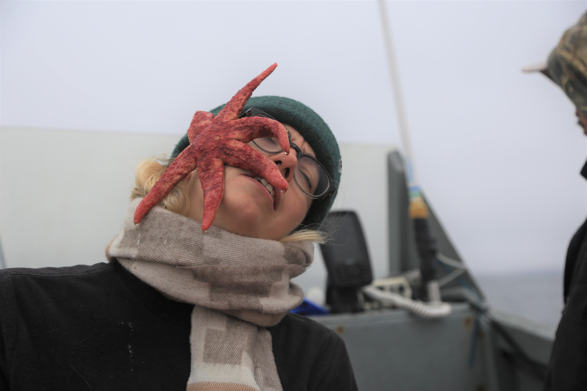

**Andra Florea, M.Sc.**

Ornithologue professionnelle cumulant plusieurs expériences, je suis également sensible et impliquée dans les questions sociales et politiques. Active au sein du conseil du module d'océanographie, du comité du programme d'océanographie, du comité féministe de l'université, j'aime aussi organiser des événements et des festivals de musique et de science. À temps perdu, j'ai fondé la page du Regroupement des TechniciensNEs et Biologistes GraduéEs du Québec, un lieu de réseautage unique, que j'administre depuis 2018 et qui compte plus de 2 800 membres. Muni d'une technique en bioécologie du Cégep de Saint-Laurent, d'un baccalauréat en biologie (écologie) de l'Université du Québec à Rimouski, j'ai intégré le Laboratoire de bioénergétique avancée pour une maîtrise en océanographie relative à une pêcherie de pétoncles d'Islande (Chlamys islandica) à Sanikiluaq, NU. Afin de quantifier et de qualifier la ressource, de nombreux paramètres biométriques ont été mesurés sur les pétoncles tels que le contenu lipidique et protéique, la calorimétrie, l'âge, la taille, le rendement en viande, l'indice de condition pour un futur permis de pêche exploratoire. En parallèle, une modélisation de la distribution des pétoncles autour de l'archipel a été réalisée en utilisant les connaissances des pêcheurs et les données disponibles sur les bases de données ouvertes. Au cours de mon baccalauréat, j'ai effectué des recherches sur l'impact de la recherche de nourriture sur le stress oxydatif chez le fou de Bassan (Morus bassanus) de la colonie de l'île Bonaventure. De plus, je travaille à un manuscrit sur la phénologie migratoire des oiseaux du Québec depuis 50 ans et je viens de publier un article sur le comportement migratoire irruptif de la Sittelle à poitrine blanche (Sitta carolinensis) dans l'est de l'Amérique du Nord. Actuellement, je travaille comme ornithologue professionnelle pour le Environnement et Changements climatiques Canada en effectuant des relevés d'oiseaux marins pélagiques.

//

Professional ornithologist accumulating several experiences, I am also sensitive and involved in social and political issues. Active with the Oceanography Module Council, the Oceanography Program Committee, the feminist committee of the university, I also enjoy organizing events and music festivals. In lost time, I founded the page of the Regroupement des TechniciensNEs et Biologistes GraduéEs du Québec, a unique networking place, which I have administered since 2018 and which has more than 2,800 members. Equipped with a technique in bioecology from Cégep de Saint-Laurent, a bachelor’s degree in biology (ecology) from the University of Quebec at Rimouski, I joined the Laboratory of Advanced Bioenergetics for a master’s degree in Oceanography relating to an Iceland scallop (Chlamys islandica) fishery in Sanikiluaq, NU. To quantify and qualify the resource, many biometrics were measured on the scallops such as lipidic and protein content, calorimetry, age, size, meat yield, condition index for a future exploratory fishing permit. On the side, a modelling of the distribution of the scallop around the archipelago was made using knowledge from the fishers and data available on open databases. During my bachelor’s degree, I carried out research on the foraging impact on oxidative stress for the northern gannet (Morus bassanus) from the Bonaventure Island colony. In addition, I have been working on a manuscript on the migratory phenology of Quebec birds for the past 50 years and just published an article about the irruptive migratory behavior of the White-breasted Nuthatch (Sitta carolinensis) in eastern North America. Currently, I am working as a professional ornithologist for Environmental and Climatic Change Canada doing pelagic seabird surveys.

<!-- ## Professional and Research Associations -->

<!-- [Ressources Aquatiques Québec](http://www.raq.uqar.ca//) 2020 – Present   -->

